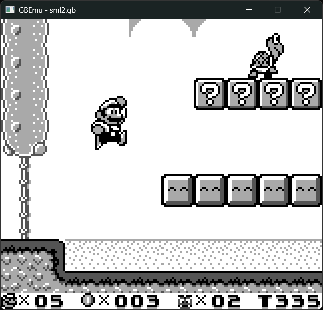

# GBEmu
GBEmu is a Gameboy emulator written in C++. Currently it's under development so a lot of stuff isn't implemented yet with quite a few bugs. But it still runs some of the commercial games.

This emulator only compiles and runs on Windows but I will make it cross-platform later in the future.

Also, feel free to let me know if you have a better name for this emulator.

# Some screenshots
## Tetris

## Super Mario Land 2

## Pokemon Red

## Zelda: Link's Awakening
